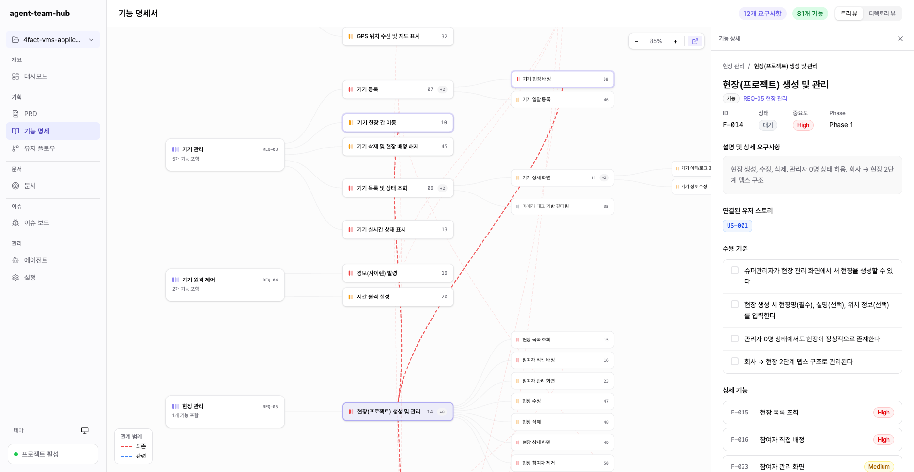
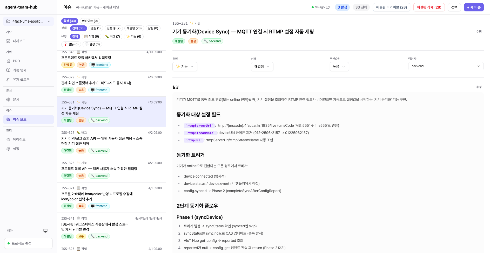

# Agent Team Hub

AI 에이전트 팀과 사람이 함께 협업하기 위한 **파일 기반 프로젝트 관리 도구**입니다.




Jira와 유사한 이슈 트래킹, PRD/기능 명세/유저 플로우 등 기획 문서 관리, 에이전트 팀 관리 기능을 제공하며, 모든 데이터를 프로젝트 디렉토리 내 JSON/Markdown 파일로 저장합니다. Claude Code 등 AI 에이전트가 파일을 직접 읽고 쓸 수 있어 **사람과 AI 간의 원활한 협업**이 가능합니다.

## 주요 특징

- **파일 기반 저장** — 모든 데이터가 JSON/Markdown 파일로 저장되어 Git 친화적이고 AI 에이전트가 직접 접근 가능
- **이슈 트래킹** — 생성, 수정, 삭제, 아카이브, 댓글, 멀티 담당자, 실시간 폴링 지원
- **기획 문서 관리** — PRD, 기능 명세, 유저 플로우 다이어그램을 구조화된 형태로 관리
- **문서 브라우저** — Markdown 문서 자동 인덱싱, 카테고리 분류, 코드 하이라이팅
- **에이전트 팀 관리** — Claude Code 에이전트 정의 및 이슈 할당 관리
- **듀얼 모드** — 로컬 서버 모드(Node.js)와 브라우저 모드(File System Access API) 지원
- **다국어 지원** — 한국어/영어 인터페이스

## 빠른 시작

### 설치

```bash
# 저장소 클론
git clone https://github.com/your-org/agent-team-hub.git
cd agent-team-hub

# 의존성 설치
npm install
```

### 실행

```bash
# 개발 모드
npm run dev

# 또는 CLI로 실행
npx agent-team-hub
```

브라우저에서 http://localhost:3100 으로 접속합니다.

### 프로젝트 설정

1. Settings 페이지에서 프로젝트 폴더를 추가합니다
2. "Initialize Project"를 체크하면 필요한 디렉토리 구조가 자동 생성됩니다
3. 대시보드에서 프로젝트 현황을 확인할 수 있습니다

## 프로젝트 디렉토리 구조

프로젝트를 초기화하면 다음 구조가 생성됩니다:

```
my-project/
├── issues/                  # 이슈 트래킹
│   ├── _index.json          # 메타데이터 (ID 카운터)
│   ├── ISS-001.json         # 개별 이슈
│   └── archive/             # 아카이브된 이슈
├── docs/                    # Markdown 문서
├── data/                    # 구조화 데이터
│   ├── prd.json             # 제품 요구사항 정의서
│   ├── features.json        # 기능 명세
│   └── userflow.json        # 유저 플로우
├── .hub/
│   └── config.json          # Hub 설정
└── .claude/
    ├── agents/              # 에이전트 정의 파일
    └── skills/hub/          # Claude Code 연동 스킬
        ├── SKILL.md
        └── scripts/issue-cli.js
```

## 기능 상세

### 대시보드

프로젝트 전체 현황을 한눈에 파악할 수 있습니다. 기획 데이터 상태, 문서 수, 활성 이슈 수, 에이전트 팀 구성을 카드 형태로 보여주며, 최근 이슈와 에이전트별 이슈 현황을 확인할 수 있습니다.

### 이슈 트래킹

| 기능 | 설명 |
|------|------|
| 상태 관리 | Open, In Progress, Resolved, Closed, Archived |
| 우선순위 | Critical, High, Medium, Low |
| 유형 | Task, Bug, Feature, Question, Decision |
| 필터링 | 상태, 유형, 텍스트 검색 |
| 일괄 작업 | 다중 선택 후 아카이브/삭제 |
| 실시간 동기화 | 3초 간격 폴링으로 변경 감지 |
| 댓글 | 이슈별 토론 스레드 |

### 기획 문서

- **PRD** — 비전, 핵심 가치, 타겟 사용자, 유저 스토리, 비기능 요구사항, MVP 범위, 로드맵, KPI
- **기능 명세** — 요구사항 그룹화, 기능 계층 구조, 의존성 추적, 수락 기준
- **유저 플로우** — 노드 기반 플로우 에디터, Mermaid 다이어그램 시각화

### 문서 브라우저

`docs/` 디렉토리의 Markdown 파일을 자동으로 인덱싱합니다. Frontmatter에서 제목, 카테고리, 작성자 정보를 추출하고, 디렉토리 구조를 기반으로 카테고리를 분류합니다.

### 에이전트 관리

`.claude/agents/` 디렉토리의 Markdown 파일로 에이전트를 정의합니다. 이름, 역할, 모델, 담당 업무 등을 설정하고, 이슈 할당 현황을 추적합니다.

## Claude Code 연동

프로젝트 초기화 시 Claude Code와의 연동을 위한 스킬과 CLI가 자동 설치됩니다.

에이전트는 CLI를 통해 이슈를 관리할 수 있습니다:

```bash
# 이슈 목록 조회
node .claude/skills/hub/scripts/issue-cli.js list

# 이슈 생성
node .claude/skills/hub/scripts/issue-cli.js create --title "버그 수정" --type bug --priority high

# 이슈 상태 변경
node .claude/skills/hub/scripts/issue-cli.js update ISS-001 --status in-progress

# 댓글 추가
node .claude/skills/hub/scripts/issue-cli.js comment ISS-001 "작업을 시작합니다"
```

## 기술 스택

| 영역 | 기술 |
|------|------|
| 프레임워크 | Next.js 16, React 19 |
| 언어 | TypeScript 5 |
| 스타일링 | Tailwind CSS 4, shadcn/ui (Radix UI) |
| 아이콘 | Lucide React |
| 다이어그램 | Mermaid |
| Markdown | react-markdown, remark-gfm |

## 스크립트

```bash
npm run dev      # 개발 서버 (port 3100)
npm run build    # 프로덕션 빌드
npm start        # 프로덕션 서버
npm run lint     # ESLint 실행
```

## 라이선스

[MIT](LICENSE)
